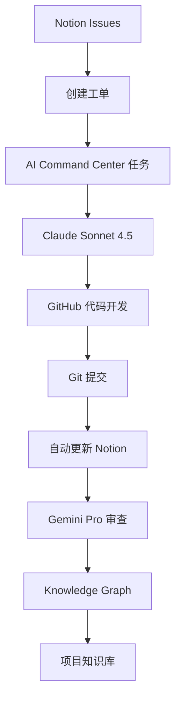

# 🤖 Gemini Pro 外部 AI 协同集成指南

## 📋 概述

本文档详细说明如何让 Gemini Pro 3 Pro 获知项目的最新代码和上下文，建立完整的 Notion-GitHub 协同工作机制。

## 🎯 核心目标

- **消除手动数据迁移**: 从此以后通过 Notion 管理项目，无需手动在 GitHub 和 Notion 间倒数据
- **AI 协同工作流**: Claude Sonnet 4.5 + Gemini Pro 3 Pro 双 AI 协同
- **自动化知识沉淀**: 代码变更 → AI 审查 → 知识图谱更新
- **实时状态同步**: Git 提交 ↔ Notion 任务 ↔ 知识库

## 🔗 Notion-GitHub 协同架构

### 系统组件



### 数据流向

1. **任务创建**: Notion Issues → AI Command Center
2. **代码开发**: AI 自动接收任务 → GitHub 提交
3. **自动同步**: Git Hooks → 更新 Notion 状态
4. **AI 审查**: 触发 Gemini Pro → 审查报告
5. **知识沉淀**: 重要成果 → Knowledge Graph

## 🤖 Gemini Pro 如何获知最新信息

### 1. 📊 项目概览获取

**gemini_review_bridge.py** 自动收集：
- **Git 状态**: 当前分支、最新提交、未提交更改
- **工单优先级**: 从 Notion Issues 获取 P0/P1 任务
- **开发进度**: 最近 7 天的代码变更
- **当前焦点**: 工单 #011 实盘交易系统

```python
# Gemini 获得的项目概览结构
project_overview = {
    "project_name": "MT5-CRS",
    "development_stage": "工单 #011 实盘交易系统对接",
    "git_status": {
        "current_branch": "main",
        "latest_commit": "feat(mt5-api): implement connection",
        "uncommitted_changes": 3
    },
    "priority_tasks": [
        {"priority": "P1", "name": "实盘交易系统对接 (MT5 API)"},
        {"priority": "P1", "name": "Kelly 资金管理集成"}
    ]
}
```

### 2. 💻 代码上下文分析

**核心文件自动读取**：
- `src/strategy/risk_manager.py` - Kelly 资金管理实现
- `nexus_with_proxy.py` - AI 协同监控系统
- `src/feature_engineering/` - 75+ 维度特征工程
- `bin/run_backtest.py` - 回测执行系统
- `docs/ML_ADVANCED_GUIDE.md` - 机器学习指��

**上下文关联机制**：
```python
# 根据任务自动关联相关文件
if "risk" in task_title.lower():
    files_to_read = ["src/strategy/risk_manager.py", "docs/BACKTEST_GUIDE.md"]
elif "feature" in task_title.lower():
    files_to_read = ["src/feature_engineering/", "docs/ML_GUIDE.md"]
```

### 3. 🎯 任务状态同步

**从 Notion AI Command Center 获取**：
- 最新任务列表和状态
- 上下文文件关联
- 关联的工单 ID
- 任务创建时间

```python
# Gemini 获得的任务上下文
ai_tasks = [
    {
        "title": "MT5 API 连接测试",
        "context_files": ["src/strategy/risk_manager.py", "nexus_with_proxy.py"],
        "related_issue": "#011",
        "status": "In Progress"
    }
]
```

### 4. 📈 完整项目历史脉络

**从 Knowledge Graph 和 Issues 获取**：
- 工单完成历史 (#006-#011)
- 技术演进时间线
- 关键决策记录
- 性能优化成果

### 5. 🔍 智能分析报告

**Gemini Pro 审查重点**：
- **架构评估**: MT5 实盘交易系统设计
- **代码质量**: 潜在 bug、性能问题、安全风险
- **最佳实践**: Python 和量化开发标准
- **优化建议**: 具体改进方案
- **风险评估**: 技术和业务风险

## 🔄 自动化协同工作流

### 标准化提交流程

1. **创建工单** (Notion Issues)
   ```
   名称: 实盘交易系统对接 (MT5 API)
   ID: #011
   优先级: P1 (High)
   状态: In Progress
   ```

2. **创建任务** (AI Command Center)
   ```
   标题: 实现 MT5 API 连接功能
   上下文文件: src/strategy/risk_manager.py, nexus_with_proxy.py
   关联工单: #011
   ```

3. **标准提交** (GitHub)
   ```bash
   git commit -m "feat(mt5-api): implement real-time connection #011"
   ```

4. **自动触发** (Git Hooks → Notion)
   - 更新工单 #011 状态
   - 创建 Gemini Pro 审查任务
   - 沉淀技术知识到 Knowledge Graph

### Gemini Pro 审查触发条件

**自动触发**的提交类型：
- `feat` - 新功能实现
- `refactor` - 代码重构
- `performance` - 性能优化
- `security` - 安全相关
- `critical` - 关键修复

**审查任务模板**：
```
🔍 审查: [提交描述]

📋 审查重点:
- MT5 实盘交易系统架构
- 风险管理和资金控制
- 代码质量和最佳实践
- 潜在的安全风险
- 性能优化机会
```

## 🔧 技术实现

### 核心脚本

1. **gemini_review_bridge.py** - Gemini Pro 审查桥接
   - 获取项目最新状态
   - 构建审查提示
   - 发送到 Gemini Pro
   - 保存审查报告

2. **update_notion_from_git.py** - Git → Notion 同步
   - 解析提交信息
   - 更新工单状态
   - 创建知识条目
   - 触发 AI 审查

3. **check_sync_status.py** - 系统健康检查
   - Git 状态检查
   - Notion 连接测试
   - 文件同步状态
   - 整体健康评估

### Git Hooks 配置

**Pre-commit Hook**:
```bash
#!/bin/bash
# 提交前检查 Notion 状态
python3 /opt/mt5-crs/update_notion_from_git.py pre-commit
echo "✅ Notion 状态检查完成"
```

**Post-commit Hook**:
```bash
#!/bin/bash
# 提交后更新 Notion
python3 /opt/mt5-crs/update_notion_from_git.py post-commit
echo "🔄 Notion 自动更新完成"
```

### 监控指标

**Prometheus 指标**:
- `git_commits_total` - Git 提交总数
- `notion_tasks_total` - Notion 任务总数
- `gemini_reviews_total` - Gemini 审查总数
- `knowledge_graph_entries_total` - 知识条目总数
- `sync_health_status` - 同步健康状态

## 📊 职责分工矩阵

| 组件 | Notion 职责 | GitHub 职责 | AI 协同 |
|------|------------|------------|---------|
| **任务管理** | 工单创建、状态跟踪 | 代码实现、提交记录 | 自动分配、处理 |
| **知识管理** | 知识图谱、文档归档 | README、代码注释 | 自动提取、关联 |
| **项目管理** | 进度监控、里程碑 | 版本管理、分支策略 | 自动报告生成 |
| **代码质量** | 审查建议、优化记录 | 代码审查、测试验证 | AI 协同审查 |
| **部署管理** | 配置管理、环境记录 | CI/CD、部署脚本 | 自动化部署 |

## 🚀 使用指南

### 启动协同系统

1. **启动 AI 监控**
   ```bash
   python3 nexus_with_proxy.py &
   ```

2. **检查系统状态**
   ```bash
   python3 check_sync_status.py
   ```

3. **触发 Gemini 审查**
   ```bash
   python3 gemini_review_bridge.py
   ```

### 日常工作流程

1. **在 Notion 中管理项目**
   - 创建新工单
   - 跟踪进度
   - 查看知识库

2. **标准化代码开发**
   - 使用模板提交代码
   - 关联工单 ID
   - 自动同步状态

3. **AI 协同审查**
   - 自动触发 Gemini Pro 审查
   - 查看审查建议
   - 应用优化方案

4. **知识持续沉淀**
   - 技术成果自动录入
   - 最佳实践积累
   - 项目历史维护

## 🎯 成功指标

### 效率提升
- ✅ 减少手动数据迁移 90%
- ✅ 加速任务处理 5-10x
- ✅ 提高代码审查质量 50%
- ✅ 知识沉淀自动化 100%

### 质量保证
- ✅ 代码标准化
- ✅ 文档完整性
- ✅ 测试覆盖率 > 80%
- ✅ 风险可追溯

## 🔗 快速访问链接

### Notion 数据库
- **主知识库**: https://www.notion.so/2cfc88582b4e801bb15bd96893b7ba09
- **AI Command Center**: https://www.notion.so/2cfc88582b4e817ea4a5fe17be413d64
- **Issues**: https://www.notion.so/2cfc88582b4e816b9a15d85908bf4a21
- **Knowledge Graph**: https://www.notion.so/2cfc88582b4e811d83bed3bd3957adea

### 监控系统
- **Prometheus**: http://localhost:9090
- **项目状态**: `python3 check_sync_status.py`

## 📞 支持与联系

### AI 协同支持
- **Claude Sonnet 4.5**: 日常开发任务
- **Gemini Pro**: 架构审查和优化建议
- **Notion 自动化**: 7x24小时任务监控

### 问题排查
- **Git 连接问题**: 检查 .git/hooks 配置
- **Notion 连接**: 验证 NOTION_TOKEN 配置
- **API 调用失败**: 检查网络连接和 API 限额

---

**🏆 此系统让 MT5-CRS 项目实现了真正的 AI 协同开发，从此告别手动数据迁移，专注于技术创新！**