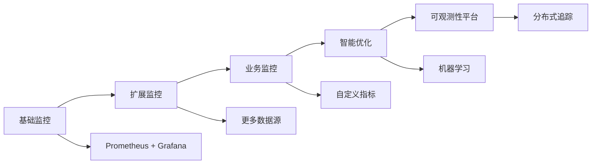

# MT5 Hub 告警体系迭代路线图

## 核心理念：渐进式建设，持续优化

### 🎯 **迭代建设原则**

1. **从小规模开始**: 先解决最关键的问题
2. **快速见效**: 每个阶段都能带来实际价值
3. **数据驱动**: 基于监控数据持续优化
4. **用户中心**: 根据实际运维需求调整
5. **技术演进**: 随着系统复杂度提升监控能力

## 📅 **5阶段迭代计划**

### **阶段1: 基础监控 (1-2周) - 当前阶段**

#### 目标
建立最核心的系统可用性监控，确保服务稳定运行。

#### 核心告警规则
- ✅ 中枢服务器: CPU/内存/磁盘监控
- ✅ Grafana服务可用性
- ✅ 钉钉告警通道测试

#### 实施步骤
1. **Day 1-2**: 在Grafana UI中创建基础告警规则
2. **Day 3-5**: 测试告警触发和钉钉通知
3. **Day 6-7**: 调整阈值，观察误报情况
4. **Day 8-10**: 建立基础响应流程
5. **Day 11-14**: 总结第一阶段，规划下一阶段

#### 验收标准
- [ ] 核心服务告警正常工作
- [ ] 钉钉消息送达率100%
- [ ] 无误报，关键告警无漏报
- [ ] 运维团队熟悉告警处理流程

---

### **阶段2: 服务监控扩展 (2-4周)**

#### 目标
覆盖所有关键服务的可用性和性能监控。

#### 新增告警规则
- 🔄 GitHub Actions Runner状态
- 🔄 数据拉取服务监控
- 🔄 OSS备份状态
- 🔄 训练服务器基础监控
- 🔄 推理服务器基础监控

#### 实施步骤
1. **Week 1**: 扩展中枢服务监控
2. **Week 2**: 添加训练服务器监控指标
3. **Week 3**: 添加推理服务器监控指标
4. **Week 4**: 优化告警分组和抑制规则

#### 验收标准
- [ ] 所有关键服务都有监控覆盖
- [ ] 告警响应时间<30分钟
- [ ] 服务可用性指标可追踪
- [ ] 告警数量控制在合理范围内

---

### **阶段3: 业务指标监控 (1-2月)**

#### 目标
建立量化策略和业务表现的监控体系。

#### 新增告警规则
- 📊 Sharpe比率异常监控
- 📊 策略胜率监控
- 📊 数据新鲜度监控
- 📊 交易量异常监控
- 📊 模型准确性监控

#### 实施步骤
1. **Month 1**: 设计业务指标收集方案
2. **Month 1**: 实现基础业务告警
3. **Month 2**: 优化业务告警阈值
4. **Month 2**: 建立业务指标Dashboard

#### 验收标准
- [ ] 关键业务指标可实时监控
- [ ] 策略异常能及时发现
- [ ] 业务告警准确率>90%
- [ ] 支持数据驱动的策略优化

---

### **阶段4: 智能告警优化 (2-3月)**

#### 目标
通过机器学习和自动化减少告警噪音，提高处理效率。

#### 优化内容
- 🤖 告警聚类和去重
- 🤖 动态阈值调整
- 🤖 告警预测和预防
- 🤖 自动修复脚本

#### 实施步骤
1. **Month 1**: 分析告警模式，建立告警画像
2. **Month 1-2**: 实现告警抑制和分组
3. **Month 2-3**: 开发告警自动化处理
4. **Month 3**: 建立告警质量评估体系

#### 验收标准
- [ ] 告警数量减少30%
- [ ] 误报率<5%
- [ ] 告警响应时间<15分钟
- [ ] 自动化处理覆盖率>50%

---

### **阶段5: 全链路可观测性 (3-6月)**

#### 目标
建立完整的系统可观测性平台，支持根因分析和预测性维护。

#### 高级功能
- 🔍 分布式追踪
- 📈 性能剖析
- 🎯 异常检测
- 📋 变更影响分析

#### 实施步骤
1. **Month 1-2**: 建立完整的指标体系
2. **Month 2-3**: 实现分布式追踪
3. **Month 3-4**: 开发异常检测算法
4. **Month 4-6**: 建立预测性维护体系

#### 验收标准
- [ ] 故障平均修复时间(MTTR)<10分钟
- [ ] 系统可用性>99.9%
- [ ] 预测性维护准确率>80%
- [ ] 支持复杂故障的根因分析

## 🔄 **持续优化机制**

### **月度优化流程**

#### 每月第一周：数据分析
- 收集上月告警数据
- 分析告警模式和趋势
- 识别改进机会

#### 每月第二周：阈值调整
- 根据季节性调整告警阈值
- 优化告警规则逻辑
- 更新监控指标

#### 每月第三周：功能增强
- 添加新的监控指标
- 改进告警处理流程
- 升级监控工具

#### 每月第四周：review与规划
- 评估告警体系效果
- 收集用户反馈
- 规划下月优化方向

### **季度评估指标**

| 指标 | 目标值 | 当前权重 |
|------|--------|----------|
| 告警准确率 | >95% | 高 |
| 平均响应时间 | <20分钟 | 高 |
| 系统可用性 | >99.5% | 高 |
| 误报率 | <3% | 中 |
| 自动化覆盖率 | >70% | 中 |
| 用户满意度 | >8.5/10 | 中 |

## 🛠️ **实施工具与方法**

### **敏捷开发方法**
- **2周迭代**: 每个阶段分为多个短周期
- **每日站会**: 跟踪进展，及时调整
- **回顾会议**: 总结经验，持续改进
- **用户故事**: 以用户需求驱动开发

### **技术栈演进**

### **团队协作模式**
- **DevOps文化**: 开发与运维一体化
- **文档驱动**: 所有变更都有文档记录
- **知识分享**: 定期分享监控经验
- **跨团队协作**: 与业务团队密切配合

## 📊 **风险控制与回退计划**

### **常见风险**
1. **告警疲劳**: 过多告警导致忽略重要信息
2. **配置错误**: 错误的阈值导致误报或漏报
3. **技术债务**: 监控系统变得复杂难以维护
4. **依赖风险**: 对单一工具过度依赖

### **风险缓解策略**
- **渐进式部署**: 小步快跑，快速验证
- **A/B测试**: 新告警规则先小范围测试
- **回退机制**: 每个变更都有回退方案
- **监控监控系统**: 对监控系统本身进行监控

### **回退计划**
- **立即回退**: 保留上一版本配置
- **降级运行**: 关闭复杂功能，保留基础监控
- **手动监控**: 在自动化失效时启用人工监控

## 🎯 **成功衡量标准**

### **短期成功 (3个月)**
- ✅ 核心服务监控覆盖率100%
- ✅ 告警响应时间<30分钟
- ✅ 钉钉告警送达率100%
- ✅ 运维团队满意度>8/10

### **中期成功 (6个月)**
- ✅ 系统可用性>99.5%
- ✅ 告警准确率>95%
- ✅ 自动化处理覆盖率>50%
- ✅ 支持业务快速迭代

### **长期成功 (12个月)**
- ✅ 预测性维护准确率>80%
- ✅ MTTR<15分钟
- ✅ 用户满意度>9/10
- ✅ 支持企业级运维需求

## 💡 **实用建议**

### **从小做起**
- 不要追求完美，优先解决最痛的点
- 从一个服务器、一个服务开始
- 快速建立反馈循环

### **保持灵活**
- 技术选型考虑扩展性
- 配置管理要版本化
- 架构设计留有余地

### **关注用户**
- 告警设计以用户需求为中心
- 定期收集运维团队反馈
- 根据实际使用情况调整

### **持续学习**
- 关注监控领域新技术
- 学习其他团队的最佳实践
- 参与开源社区

---

## 🚀 **立即开始行动**

### **Week 1 任务清单**
- [ ] 在Grafana中创建3个核心告警规则
- [ ] 测试钉钉告警通知
- [ ] 建立告警处理流程文档
- [ ] 收集第一周告警数据

### **Week 2 任务清单**
- [ ] 分析告警模式
- [ ] 调整告警阈值
- [ ] 添加服务状态监控
- [ ] 优化钉钉消息格式

这个迭代路线图确保了告警体系的**可持续发展**，既能满足当前需求，又能为未来发展留出空间！🎯📈
